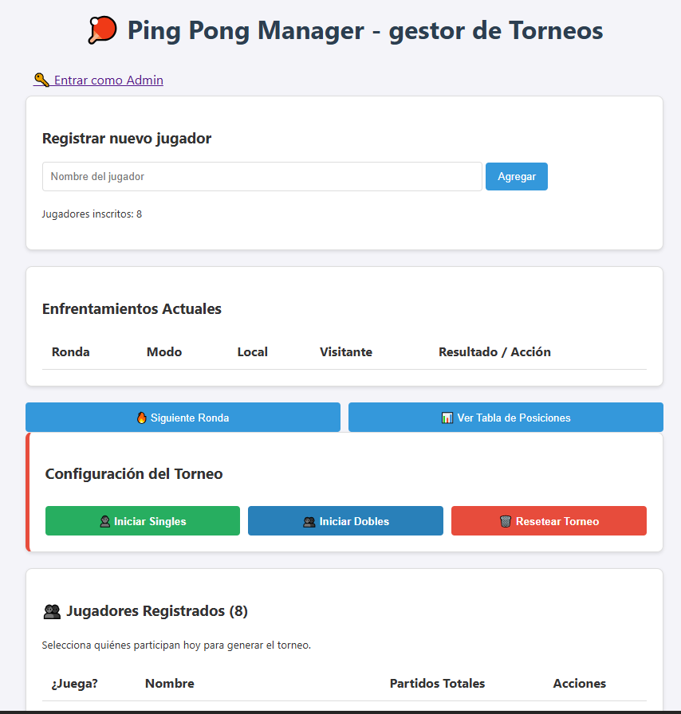
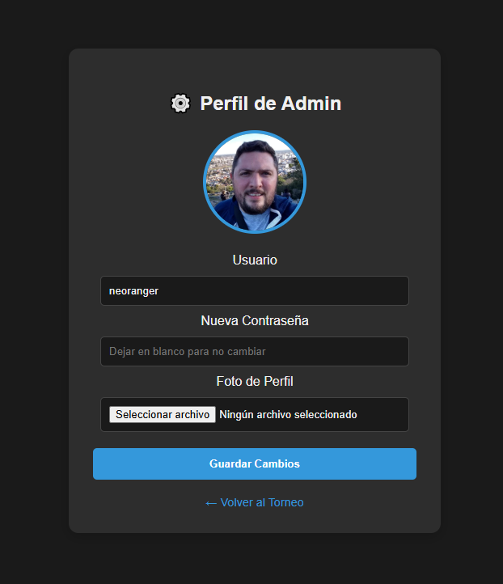
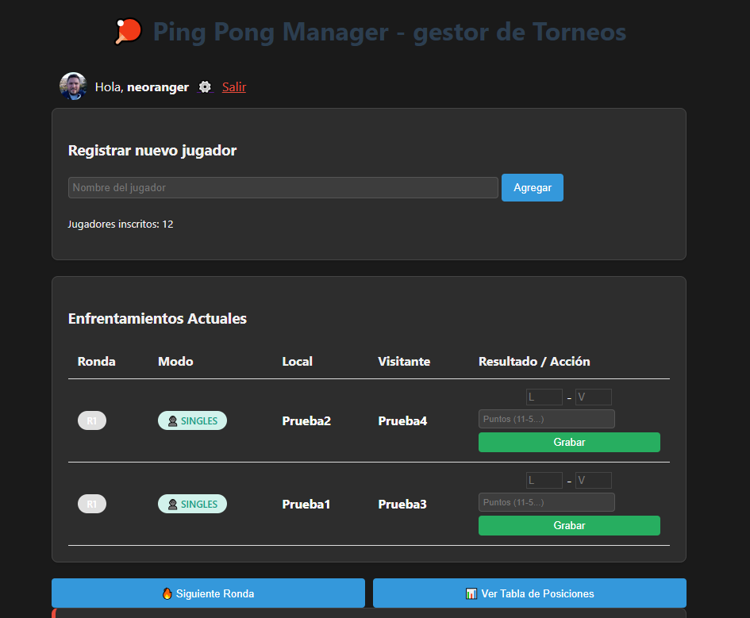
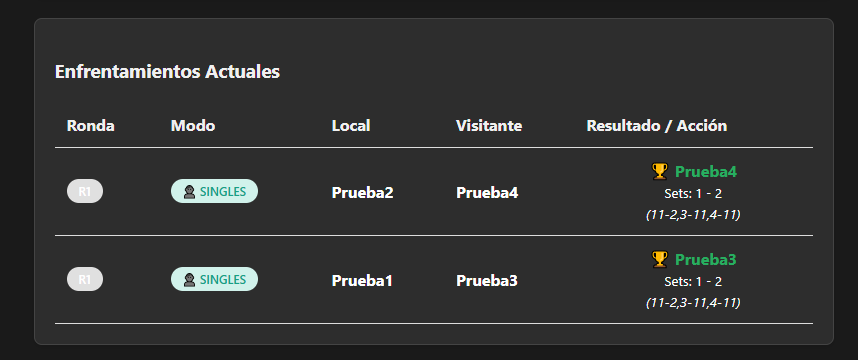
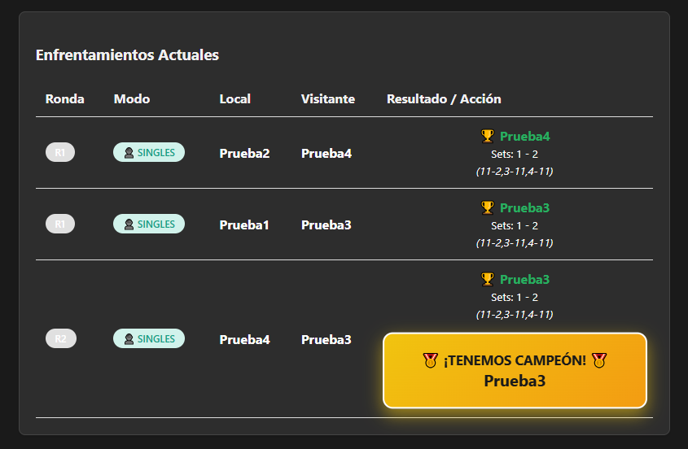
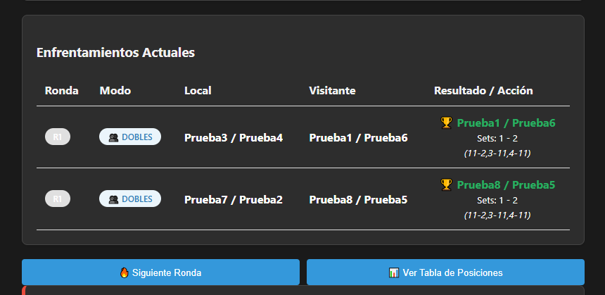
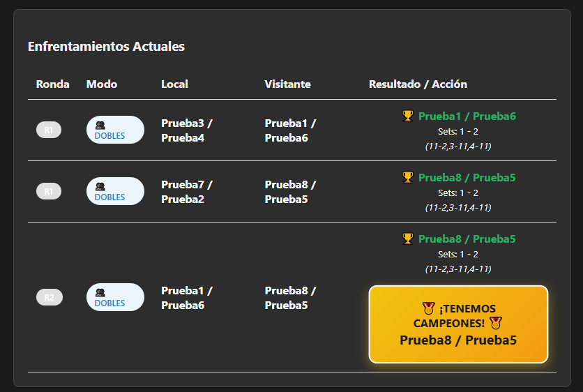

# 🏓 Ping Pong Manager - Full Stack Tournament Creator
#### Ping Pong Manager es una aplicación web integral diseñada para organizar y gestionar torneos de tenis de mesa (o cualquier deporte de 1v1 y 2v2). Permite llevar un control total desde el registro de jugadores hasta la coronación del campeón, con una interfaz adaptada para dispositivos móviles.

### ✨ Características Principales
- 🏆 Gestión de Torneos Dinámica: Soporte nativo para llaves de Singles (1 vs 1) y Dobles (2 vs 2).
- 👥 Convocatoria de Jugadores: Registro persistente de jugadores con capacidad de "convocarlos" (selección activa) para el torneo del día.
- 🔐 Panel de Administración Seguro: Acceso restringido para gestionar resultados, editar jugadores y resetear torneos.
- 👤 Perfiles Personalizables: El administrador puede cambiar su nombre, contraseña y subir su propio Avatar.
- 📱 Diseño Responsivo & Dark Mode: Interfaz optimizada para celulares mediante tablas que se transforman en tarjetas y modo oscuro persistente (LocalStorage).
- 📊 Estadísticas en Tiempo Real: Contador de partidos por jugador, seguimiento de sets y tabla de posiciones dinámica con desempate por diferencia de puntos.

### 🛠️ Tecnologías Utilizadas
- **Backend**: Python 3.11 + Flask.
- **Base de Datos**: SQLite con SQLAlchemy (ORM).
- **Seguridad**: Flask-Login para sesiones y Werkzeug para hashing de contraseñas.
- **Frontend**: HTML5, CSS3 (Variables, Flexbox, Grid, Media Queries) y JavaScript Vanilla.
- **Despliegue**: Docker & Docker Compose.

### 🚀 Instalación Rápida con Docker

Si quieres probarlo ahora mismo sin configurar el entorno de Python, usa Docker:

1. Clona el repositorio:
```
git clone https://github.com/tu-usuario/ping-pong-manager.git
cd ping-pong-manager
```

2. Lanza la aplicación:
```
docker-compose up -d
```

3. Accede a la app: Abre tu navegador en **http://localhost:5051**.

**Nota: El usuario administrador por defecto es admin y la contraseña es admin123. ¡Recuerda cambiarla en el panel de configuración al entrar!**

📂 Estructura del Proyecto

```
├── app.py              # Lógica principal y rutas de Flask
├── models.py           # Definición de modelos de base de datos
├── static/
│   └── uploads/
│       └── avatars/    # Avatares subidos por el admin
├── templates/
│   ├── index.html      # Dashboard principal y llaves
│   ├── login.html      # Acceso administrativo
│   └── perfil.html     # Configuración de usuario
├── Dockerfile          # Configuración de la imagen
└── docker-compose.yml  # Orquestación de contenedores y volúmenes
```

### NOTA: Recordá que debes crear el archivo torneo.db y el directorio /static/uploads/avatars de manera local para los permisos necesarios de ejecución

🤝 Contribuir
¡Las contribuciones son bienvenidas! Si tienes ideas para nuevas funcionalidades (como integración con Telegram, exportación a Excel o historial de campeones), siéntete libre de:

1. Hacer un **Fork** del proyecto.
2. Crear una rama para tu mejora *(git checkout -b feature/MejoraIncreible)*.
3. Hacer un **Commit** de tus cambios.
4. Abrir un **Pull Request**.

### Desarrollado con ❤️ para la comunidad de software libre y los amantes del Ping Pong.

### Algunas capturas de pantalla de la aplicación














